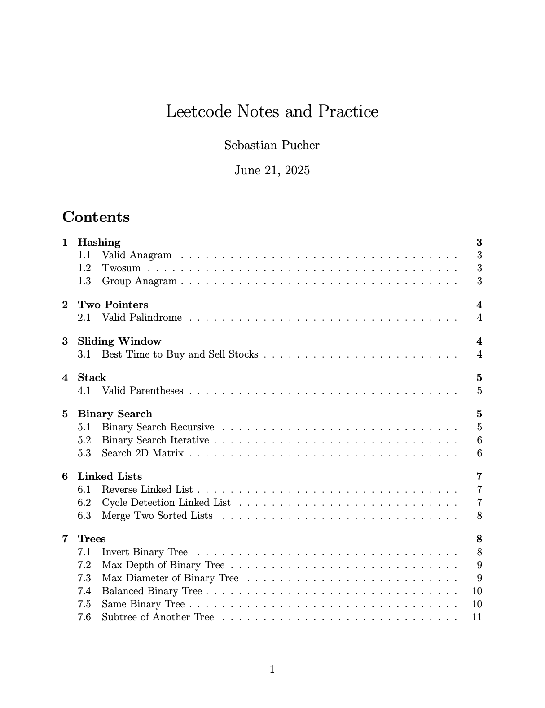

# LC100: 100 Days of Leetcode

For my last summer before I'm a senior at BC, I've set out to challenge myself with practicing at least one LeetCode question every day for 100 days straight. The goal here is consistency and gradual improvement in my problem-solving skills.

## Progress Heatmap

The heat map above tracks my daily progress. I consider a day a win so long as I push a solution -- whether I nailed the problem or just put forth a genuine effort.

### A day gets credited when I either:

1. Submit a solution to a new problem
2. Modify/improve an existing solution

The heatmap is made using this janky seaborn wrapper called july -- currently the main repo has a ton of bugs. I've forked and cleaned up a lot of them: you can find that here: [sebas-july](https://github.com/SebPuchi/july)

## Integrity & Automation 

To keep myself accountable, I've set up a github actions bot to automatically monitor my progress. Every night at midnight ET, the server examines my git commit history to detect if I've made any updates to ./questions

If activity is detected, I get credit for that day. The idea here is that git history never lies and I can't go back and change things even if I wanted to. 

The automation script that I cooked up handles most of the heavy lifting

[update_status.py](./update_status.py) does the following every night:

1. Automatically generates the progress heat map
2. Updates this README with my current progress
3. Maintains the completed questions table below

## Notes
Once I feel comfortable with a completed question, I write up solutions notes and add it it to my ongoing latex file

  

## Completed Questions
| Question | Category | Difficulty |
|:-----------------------------|:---------|:------------|
| [min_cost_climbing_stairs](./questions/one_dimensional_dp/easy/min_cost_climbing_stairs.py) | one_dimensional_dp | `easy` |
| [climbing_stairs](./questions/one_dimensional_dp/easy/climbing_stairs.py) | one_dimensional_dp | `easy` |
| [max_area_of_island](./questions/graphs/medium/max_area_of_island.py) | graphs | `medium` |
| [number_of_islands](./questions/graphs/medium/number_of_islands.py) | graphs | `medium` |
| [single_number](./questions/hashmap/easy/single_number.py) | hashmap | `easy` |
| [anagram](./questions/hashmap/easy/anagram.py) | hashmap | `easy` |
| [twosum](./questions/hashmap/easy/twosum.py) | hashmap | `easy` |
| [group_anagrams](./questions/hashmap/medium/group_anagrams.py) | hashmap | `medium` |
| [validpal](./questions/two_pointers/easy/validpal.py) | two_pointers | `easy` |
| [two_sum_II](./questions/two_pointers/medium/two_sum_II.py) | two_pointers | `medium` |
| [valid_parentheses](./questions/stack/easy/valid_parentheses.py) | stack | `easy` |
| [min_stack](./questions/stack/medium/min_stack.py) | stack | `medium` |
| [stocks](./questions/sliding_window/easy/stocks.py) | sliding_window | `easy` |
| [longest_substring_without_repeating_characters](./questions/sliding_window/medium/longest_substring_without_repeating_characters.py) | sliding_window | `medium` |
| [linked_list_cycle_detection](./questions/linked_list/easy/linked_list_cycle_detection.py) | linked_list | `easy` |
| [reverse_list](./questions/linked_list/easy/reverse_list.py) | linked_list | `easy` |
| [merge_linked_lists](./questions/linked_list/easy/merge_linked_lists.py) | linked_list | `easy` |
| [reorder_list](./questions/linked_list/medium/reorder_list.py) | linked_list | `medium` |
| [balanced_binary_tree](./questions/trees/easy/balanced_binary_tree.py) | trees | `easy` |
| [diameter_of_binary_tree](./questions/trees/easy/diameter_of_binary_tree.py) | trees | `easy` |
| [sub_tree_of_tree](./questions/trees/easy/sub_tree_of_tree.py) | trees | `easy` |
| [invert_tree](./questions/trees/easy/invert_tree.py) | trees | `easy` |
| [max_depth_binary_tree](./questions/trees/easy/max_depth_binary_tree.py) | trees | `easy` |
| [same_tree](./questions/trees/easy/same_tree.py) | trees | `easy` |
| [binary_tree_level_order_traversal](./questions/trees/medium/binary_tree_level_order_traversal.py) | trees | `medium` |
| [subsets](./questions/backtracking/medium/subsets.py) | backtracking | `medium` |
| [binary_search_interative](./questions/binary_search/easy/binary_search_interative.py) | binary_search | `easy` |
| [binary_search_recursive](./questions/binary_search/easy/binary_search_recursive.py) | binary_search | `easy` |
| [koko_eats_bananas](./questions/binary_search/meduim/koko_eats_bananas.py) | binary_search | `meduim` |
| [search_2D_matrix](./questions/binary_search/meduim/search_2D_matrix.py) | binary_search | `meduim` |
| [last_stone_weight](./questions/heaps/easy/last_stone_weight.py) | heaps | `easy` |
| [kth_largest](./questions/heaps/easy/kth_largest.py) | heaps | `easy` |
| [k_closest_points_to_orgin](./questions/heaps/medium/k_closest_points_to_orgin.py) | heaps | `medium` |
